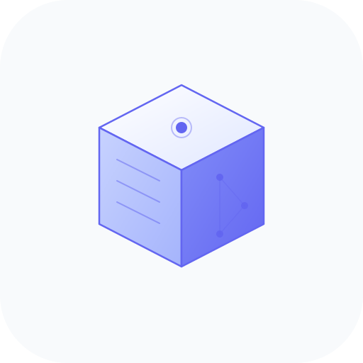

# 🧠 BlockMind



> **Fabric Mod + AI + 记忆系统** · Minecraft 智能玩伴

[](https://python.org)
[](https://openjdk.org)
[](https://minecraft.net)
[](LICENSE)

Fabric Mod 提供精准游戏接口 + Python 后端驱动 AI 决策 + 记忆系统跨会话学习。**同时支持服务端和客户端**，可在单人游戏、LAN 联机或服务器中使用。

🌐 [English](README-en.md) | [日本語](README-ja.md) | [한국어](README-ko.md) | [العربية](README-ar.md) | [Deutsch](README-de.md) | [Español](README-es.md) | [Français](README-fr.md)

---

## 为什么选择 BlockMind

### 1. 记忆系统 — AI 会学习

传统 AI 玩伴每次重启都忘光。BlockMind 有三层持久记忆：

- **空间记忆**：自动记住建筑保护区、危险区域、资源矿点
- **路径记忆**：缓存成功路径，黑名单失败路径，下次直接复用
- **策略记忆**：成功操作自动沉淀为可复用策略，零 Token 消耗

AI 导航时自动避开玩家建筑，永远不会炸家。

### 2. 双 Agent 架构 — 省 Token

```
主 Agent（~50 Token/次）：只做聊天 + 意图识别
操作 Agent（<1500 Token/次）：无状态执行，用完即弃
```

对比单 Agent 方案（>4000 Token/次），节省 84% 成本。

### 3. 服务端 + 客户端双模式

| 模式 | 安装位置 | 玩家 | 场景 |
|------|----------|------|------|
| 服务端 | 服务器 `mods/` | FakePlayer (Bot) | 服务器 7×24 挂机 |
| 客户端 | 客户端 `mods/` | 本地玩家 | 单人游戏 / LAN 联机 |

### 4. Baritone 集成 + 建筑保护

AI 使用 Baritone 寻路（自动挖路/搭桥/游泳），但会自动绕开你标记的建筑保护区。记忆中的建筑会实时注入 Baritone 排除区域。

### 5. Skill DSL + 市场

用 YAML 定义可复用的 AI 技能（挖矿、种田、建房），社区共享。AI 生成的技能自动保存，下次执行零 Token。

### 6. Dynmap 地图集成（可选）

集成 Dynmap 地图数据，在 WebUI 中直接查看机器人位置、建筑保护区、危险区域标记。Dynmap 为可选依赖，不影响核心功能。

---

## 快速开始

### 环境要求

- Python 3.10+ · Java 17+ · Minecraft 1.20.0 ~ 26.1.2

### 一键启动（Linux / macOS）

```bash
git clone https://github.com/bmbxwbh/BlockMind.git
cd BlockMind
chmod +x start.sh && ./start.sh
```

脚本会自动：
1. 检测是否已安装 → 显示 启动/修复/卸载/重装 菜单
2. 选择运行模式 → 服务端（自动下载 MC）或 客户端（自行安装 MC）
3. 创建虚拟环境 + 安装依赖
4. 启动 BlockMind + WebUI

### 一键启动（Windows）

```cmd
git clone https://github.com/bmbxwbh/BlockMind.git
cd BlockMind
start.bat
```

### Docker

```bash
docker pull ghcr.io/bmbxwbh/blockmind:latest
docker run -d --name blockmind -p 19951:19951 \
  -v ./config.yaml:/app/config.yaml:ro \
  ghcr.io/bmbxwbh/blockmind:latest
```

或使用 docker-compose：

```bash
git clone https://github.com/bmbxwbh/BlockMind.git && cd BlockMind
cp config.example.yaml config.yaml
# 编辑 config.yaml
docker compose up -d
```

### 配置

编辑 `config.yaml`：

```yaml
ai:
  main_agent:
    provider: openai
    api_key: "sk-your-key"
    model: gpt-4o
webui:
  enabled: true
  port: 19951
dynmap:                    # 可选：Dynmap 地图集成
  enabled: false
  host: localhost
  port: 8163
```

启动后访问 `http://localhost:19951` 进入控制面板。

---

## 架构

```
┌──────────────── Minecraft ────────────────┐
│  BlockMind Fabric Mod (Java)              │
│  状态采集 · 动作执行 · 事件监听            │
│  HTTP API :25580 · WebSocket              │
└──────────────────┬────────────────────────┘
                   │
┌──────────────────▼────────────────────────┐
│  BlockMind Python 后端                     │
│  ┌──────────┐  ┌──────────────────────┐  │
│  │ 主 Agent  │  │ 操作 Agent (无状态)  │  │
│  │ 聊天+识别  │  │ Skill匹配/生成/执行  │  │
│  └─────┬────┘  └──────────┬───────────┘  │
│  ┌─────▼──────────────────▼───────────┐  │
│  │ 记忆系统 · 智能导航 · Skill 引擎    │  │
│  └────────────────┬───────────────────┘  │
│  ┌────────────────▼───────────────────┐  │
│  │ WebUI + Dynmap 地图 (可选)         │  │
│  └────────────────────────────────────┘  │
└──────────────────────────────────────────┘
```

---

## WebUI 控制面板

`http://localhost:19951` — Lucide 图标 + MiuiX 暗色主题

| 功能 | 说明 |
|------|------|
| 仪表盘 | 实时状态、快捷指令、事件流 |
| 地图 | Dynmap 地图视图、机器人位置、区域标记 |
| Skill 管理 | 在线编辑 YAML、一键执行 |
| Skill 市场 | 社区技能浏览、安装、导入导出 |
| 记忆系统 | 查看/备份/清理/导入导出 |
| 模型配置 | 双 Agent 模型配置、热切换 |
| 安全设置 | 风险等级、审计日志 |
| 任务队列 | 执行状态监控 |
| 日志中心 | 实时 WebSocket 日志流 |

---

## Fabric Mod API

| 端点 | 方法 | 说明 |
|------|------|------|
| `/api/status` | GET | 玩家状态 |
| `/api/inventory` | GET | 背包信息 |
| `/api/entities` | GET | 附近实体 |
| `/api/move` | POST | 移动到坐标 |
| `/api/dig` | POST | 挖掘方块 |
| `/api/place` | POST | 放置方块 |
| `/api/attack` | POST | 攻击实体 |
| `/api/chat` | POST | 发送聊天 |

完整 API 文档见 [Fabric Mod API](docs/MOD_BUILD.md)。

---

## 支持版本

| MC 版本 | Java | 状态 |
|---------|------|------|
| 1.20.0 ~ 1.20.6 | 17~21 | ✅ |
| 1.21 ~ 1.21.4 | 21 | ✅ |
| 26.1 ~ 26.1.2 | 25 | ✅ 最新 |

---

## FAQ

**Q: 必须装 Baritone 吗？** 不必须，没有时回退到基础 A*。

**Q: 记忆数据存在哪？** `data/memory/` 目录，5 个 JSON 文件。

**Q: 支持哪些 AI 模型？** OpenAI 兼容格式（DeepSeek/OpenRouter/MiMo）+ Anthropic。

**Q: 可以在单人游戏用吗？** 可以，启动时选择客户端模式，将 Mod 放入客户端 `mods/` 即可。

**Q: Dynmap 必须装吗？** 不必须，`dynmap.enabled: false` 时不影响任何功能。安装后可在 WebUI 地图页查看机器人位置。

---

## 许可证

AGPL-3.0 — 强传染性开源协议，任何修改和网络服务使用必须开源回馈。贡献者需签署 [CLA](CLA.md)，项目所有者保留双重授权权利。详见 [LICENSE](LICENSE)。
